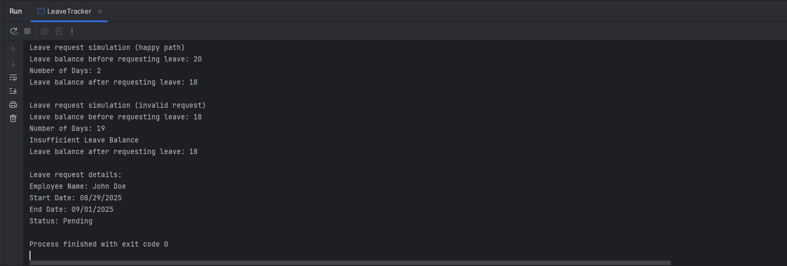

# Capstone: Part 1 Leave Tracking System
Guided Laboratory: OOP Basics - Leave Tracking

Objective: To applu the fundamental concepts of Object Oriented Programming (Classes, Objects, Encapsulation, and Constructors) by creating the core components of a leave tracking application

# Output

