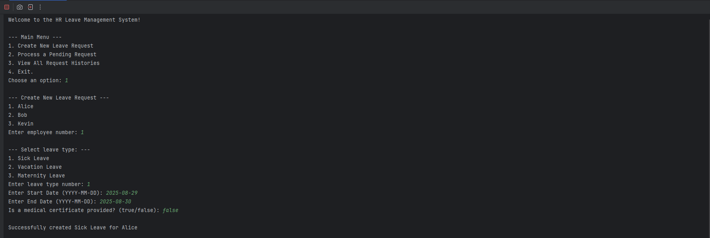
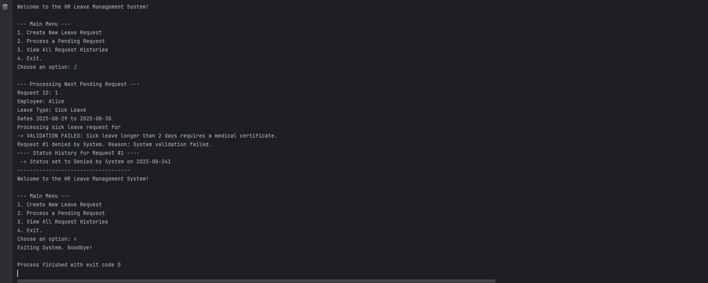

# Capstone: Part 2 HR Leave System
Guided Laboratory: Advanced OOP in Java - HR Leave System

Objective: To apply the concepts of Inheritance, Polymorphism, Interfaces, Abstract Classes, and Inner Classes by building a flexible leave request processing system.

# Output

